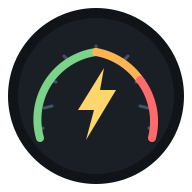
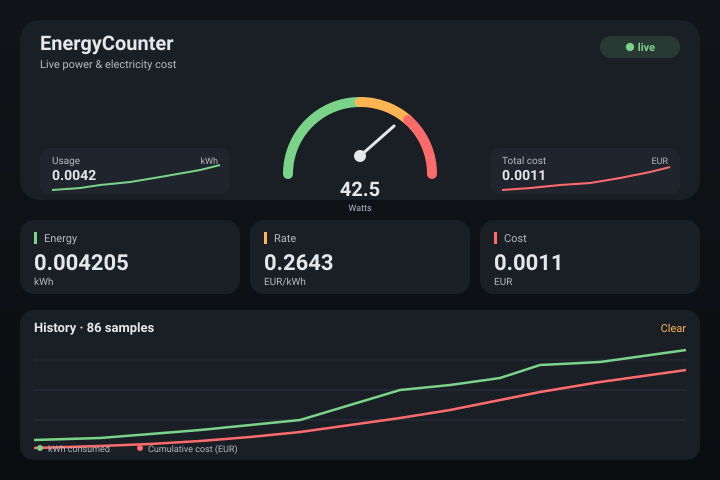

<p align="center">
  
</p>

<h1 align="center">EnergyCounter</h1>

<p align="center">
  Live electricity-cost calculator built with Kotlin Multiplatform + Compose Multiplatform.<br/>
  Samples your device's power draw, pulls real day-ahead spot prices for your country,
  and shows running kWh and EUR cost on a speedometer dashboard.
</p>

---

## Screenshots

<p align="center">
  
</p>

> _Mockup above — replace `docs/screenshot.svg` (or add `docs/screenshot.png` and switch the path) with a real capture._

## Features

- **Speedometer power gauge** with animated needle, gradient arc and live source label.
- **Auto-detect location**: GPS + Geocoder on Android, IP geolocation (ipinfo.io → api.country.is fallback) on desktop.
- **Tap-a-country world map** in the price-source card to override your region manually.
- **Live spot prices**:
  - DE / AT — Awattar (`api.awattar.de`, `api.awattar.at`)
  - NL, BE, FR, CH, LU, PL, PT, ES, IT, DK, NO, SE, FI, HU, CZ, SK, IE, GR, HR, SI, RO, BG, EE, LV, LT, RS — energy-charts.info (Fraunhofer ISE)
  - Anywhere else — fall back to a fixed price you type in.
- **Collapsing toolbar** with sparklines: usage (kWh) and cumulative cost are visible whether the header is expanded or shrunk.
- **Persistent history** at `~/.energy-counter/sessions.ndjson` (desktop) or app `filesDir` (Android); the chart re-loads on startup and shows visual gaps for paused sessions.
- **Cumulative cost chart** on a shared time axis with kWh consumed.
- **Selectable text** everywhere — copy any metric out of the UI.

## Platforms

| Target  | Power source                                | Price source                                     |
|---------|---------------------------------------------|--------------------------------------------------|
| Desktop | OSHI · CPU load × estimated TDP             | Awattar / energy-charts.info via country lookup  |
| Android | `BatteryManager.BATTERY_PROPERTY_CHARGE_COUNTER` deltas × live voltage | Same as desktop                                  |
| iOS     | Stubbed (no monitor implementation yet)     | Same as desktop                                  |

## Running

```bash
# Desktop (hot reload)
./gradlew :app:desktopApp:hotRun --auto

# Desktop (standard)
./gradlew :app:desktopApp:run

# Android
./gradlew :app:androidApp:assembleDebug

# Ktor server scaffold (placeholder)
./gradlew :server:run
```

iOS: open `app/iosApp` in Xcode and run.

## Tests

```bash
./gradlew :core:jvmTest :app:shared:jvmTest
```

CI runs both on every push and PR to `main` (see `.github/workflows/ci.yml`).

## Architecture

```
core/          ── Pure-Kotlin domain models (PowerReading, EnergyAccumulator, ElectricityRate)
app/shared/    ── Compose UI, expect/actual interfaces:
                   * PowerMonitor    (JVM = OSHI, Android = BatteryManager)
                   * LocationProvider (JVM = IP geo, Android = GPS + IP fallback)
                   * SessionStore    (file-backed NDJSON per platform)
                   PriceProvider implementations (Awattar, energy-charts) +
                   PriceProviderResolver that maps ISO country codes to providers.
app/androidApp ── Android entry point and runtime permission flow
app/desktopApp ── Desktop entry point
app/iosApp     ── iOS entry point
server/        ── Ktor server placeholder
```

## Notes on accuracy

The desktop monitor uses CPU load × estimated TDP because Windows doesn't expose
RAPL/MSR-based package power to user-space without a signed kernel driver. For
real package power you can layer in [LibreHardwareMonitor](https://github.com/LibreHardwareMonitor/LibreHardwareMonitor)
running its HTTP endpoint at `localhost:8085/data.json`, or a smart plug (Shelly,
Tasmota, Tapo) for true wall-socket measurement. Both are easy to add via a new
`PowerMonitor` actual.

## License

No license is set yet — assume "All rights reserved" until one is added.
